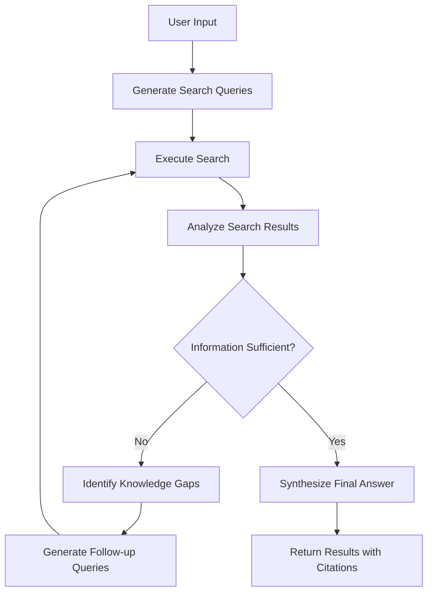

# In-Depth Project Architecture Analysis

## 🏗️ Overall System Architecture

### Technology Stack Overview
```
┌─────────────────┐    ┌─────────────────┐    ┌─────────────────┐
│   React         │    │   LangGraph     │    │   External      │
│   Frontend      │    │   Backend       │    │   Services      │
│                 │    │                 │    │                 │
│ • Vite         │◄──►│ • FastAPI      │◄──►│ • Google Search │
│ • TypeScript   │    │ • LangGraph    │    │ • Gemini API    │
│ • Tailwind CSS │    │ • Redis        │    │ • PostgreSQL    │
│ • Shadcn UI    │    │ • AsyncIO      │    │                 │
└─────────────────┘    └─────────────────┘    └─────────────────┘
```

## 🔄 Agent Workflow Detailed Analysis

### State Graph Structure


### Core Node Functions

#### 1. Query Generation Node
- **File**: `backend/src/agent/graph.py` - `generate_queries`
- **Function**: Generate multiple search queries based on user input
- **Model**: Gemini-1.5-flash
- **Input**: User question
- **Output**: List of search queries

#### 2. Search Node
- **File**: `backend/src/agent/graph.py` - `search_web`
- **Function**: Execute web searches and collect results
- **Tool**: Google Search API
- **Input**: List of search queries
- **Output**: Collection of search results

#### 3. Reflection Node
- **File**: `backend/src/agent/graph.py` - `reflect_on_search`
- **Function**: Analyze search results, judge information sufficiency
- **Model**: Gemini-1.5-flash
- **Input**: Question + search results
- **Output**: Reflection conclusion + follow-up query suggestions

#### 4. Answer Generation Node
- **File**: `backend/src/agent/graph.py` - `generate_answer`
- **Function**: Synthesize final answer based on collected information
- **Model**: Gemini-1.5-flash
- **Input**: Question + all search results
- **Output**: Structured answer + citation sources

## 📁 File Structure Detailed Analysis

### Backend Architecture
```
backend/
├── src/agent/
│   ├── __init__.py          # Module initialization
│   ├── app.py              # LangGraph application definition
│   ├── configuration.py    # Configuration management and validation
│   ├── graph.py            # Core state graph logic ⭐
│   ├── prompts.py          # Prompt templates ⭐
│   ├── state.py            # State data structures ⭐
│   ├── tools_and_schemas.py # Tool definitions and data schemas
│   └── utils.py            # Utility functions
├── .env.example            # Environment variable template
├── langgraph.json          # LangGraph configuration
├── pyproject.toml          # Python dependencies and configuration
├── Makefile                # Build and run scripts
└── test-agent.ipynb        # Jupyter test notebook
```

### Frontend Architecture
```
frontend/
├── src/
│   ├── components/         # React components
│   ├── App.tsx            # Main application component
│   ├── main.tsx           # Application entry point
│   └── index.css          # Global styles
├── public/                # Static assets
├── package.json           # Node.js dependencies
├── vite.config.ts         # Vite configuration
├── tailwind.config.js     # Tailwind CSS configuration
└── components.json        # Shadcn UI configuration
```

## 🔧 Key Code Analysis

### 1. State Definition (state.py)
```python
from typing import Annotated, List
from typing_extensions import TypedDict
from langgraph.graph.message import add_messages

class State(TypedDict):
    # Message history - accumulated using add_messages function
    messages: Annotated[List[BaseMessage], add_messages]
    # List of search queries
    search_queries: List[str]
    # Search results
    search_results: List[dict]
    # Reflection count
    reflection_count: int
    # Final answer
    final_answer: str
```

### 2. Prompt Design (prompts.py)
- **Query Generation Prompt**: Guides the model to extract key search terms from user questions
- **Reflection Prompt**: Evaluates search result quality, identifies information gaps
- **Answer Generation Prompt**: Integrates information, generates structured responses

### 3. Graph Structure Definition (graph.py)
```python
# Create state graph
graph = StateGraph(State)

# Add nodes
graph.add_node("generate_queries", generate_queries)
graph.add_node("search_web", search_web)
graph.add_node("reflect_on_search", reflect_on_search)
graph.add_node("generate_answer", generate_answer)

# Define edges and conditional routing
graph.add_edge(START, "generate_queries")
graph.add_edge("generate_queries", "search_web")
graph.add_edge("search_web", "reflect_on_search")
graph.add_conditional_edges(
    "reflect_on_search",
    should_continue_research,  # Condition function
    {
        "continue": "search_web",  # Continue searching
        "finish": "generate_answer"  # Generate answer
    }
)
```

## 🎯 Core Design Patterns

### 1. State-Driven Workflow
- All nodes share state object
- State is passed and updated between nodes
- Supports state checkpoints and recovery

### 2. Conditional Routing
- Next step decided based on search result quality
- Maximum iteration limit prevents infinite loops
- Flexible decision logic

### 3. Tool Integration
- Modular tool definitions
- Standardized input/output formats
- Easy to extend with new tools

### 4. Streaming Response
- Real-time state updates
- Progressive frontend display
- Great user experience

## 🚀 Performance Optimization Points

### 1. Concurrent Search
- Multiple search queries executed in parallel
- Asynchronous I/O handling
- Connection pool management

### 2. Caching Strategy
- Search result caching
- Model response caching
- Redis as caching layer

### 3. Resource Management
- Connection pool reuse
- Memory usage optimization
- Graceful error handling

## 🔍 Debugging and Monitoring

### 1. LangSmith Integration
- Execution trace tracking
- Performance metrics monitoring
- Debug information logging

### 2. Logging System
- Structured log recording
- Different log levels
- Easy troubleshooting

### 3. Health Checks
- API endpoint status monitoring
- Dependent service checks
- Automatic recovery mechanisms

---

## 📚 Further Reading

1. [LangGraph Concepts Explained](https://langchain-ai.github.io/langgraph/concepts/)
2. [Agent Architecture Best Practices](https://langchain-ai.github.io/langgraph/how-tos/)
3. [Google Gemini API Documentation](https://ai.google.dev/docs)
4. [React State Management Guide](https://react.dev/learn/managing-state)
