# Joseph Learns LangGraph 🤖

> In-depth learning practice based on Google Gemini Fullstack LangGraph Quickstart

Welcome to my LangGraph learning journey! This repository documents my complete process of learning and practicing LangGraph to build intelligent research assistants.

## 🎯 Project Goals

Through in-depth analysis and refactoring of the [Google Gemini Fullstack LangGraph Quickstart](https://github.com/google-gemini/gemini-fullstack-langgraph-quickstart) project, master:

- **LangGraph** state graphs and Agent architecture design
- **RAG (Retrieval-Augmented Generation)** system implementation
- **Full-stack development** React + Python + LangGraph
- **AI Agent** workflow design and optimization
- **Production-grade deployment** Docker containerization and operations

## 📚 Learning Documentation Navigation

### 🏗️ Core Documents
- **[📖 Learning Playbook](LANGGRAPH_LEARNING_PLAYBOOK.md)** - Complete 10-day learning plan
- **[🔍 Project Architecture Analysis](PROJECT_ANALYSIS.md)** - In-depth technical analysis and code interpretation
- **[🚀 Quick Start Guide](QUICK_START.md)** - Get hands-on immediately
- **[📝 Learning Progress Record](LEARNING_LOG.md)** - Personal learning log template

### 🛣️ Learning Path

```mermaid
graph LR
    A[📖 Playbook] --> B[🔍 Project Analysis]
    B --> C[🚀 Quick Start]
    C --> D[💻 Hands-on Practice]
    D --> E[📝 Record Summary]
    E --> F[🎉 Complete Project]
```



## 🌟 Original Project Features

Based on Google's open-source project, this system implements:

- 🧠 **Intelligent Research Assistant** - Agent architecture based on LangGraph
- 🔍 **Dynamic Search Strategy** - Automatically generate and optimize search queries
- 🌐 **Multi-source Information Aggregation** - Integrated Google Search API
- 🤔 **Reflective Learning** - Identify knowledge gaps and iteratively improve
- 📄 **Citation Generation** - Provide verifiable information sources
- 💬 **Full-stack Application** - React frontend + FastAPI backend

## 🛠️ Technology Stack

### Frontend Technologies
- **React** + **TypeScript** - Modern frontend framework
- **Vite** - Fast build tool
- **Tailwind CSS** - Utility-first CSS framework
- **Shadcn UI** - High-quality component library

### Backend Technologies
- **LangGraph** - AI Agent framework
- **FastAPI** - High-performance Python web framework
- **Google Gemini** - Advanced language models
- **Redis** + **PostgreSQL** - Data storage and caching

### Development Tools
- **Docker** - Containerized deployment
- **LangSmith** - Agent debugging and monitoring
- **Google Search API** - Web search integration

## 🚀 Quick Experience

Want to start immediately? Jump to **[🚀 Quick Start Guide](QUICK_START.md)**

```bash
# Clone original project
git clone https://github.com/google-gemini/gemini-fullstack-langgraph-quickstart.git

# Configure environment variables
echo 'GEMINI_API_KEY="your_api_key"' > backend/.env

# Start project
make dev
```

## 📈 Learning Progress Tracking

### Current Status
- [x] Project analysis completed
- [x] Learning plan established
- [x] Documentation framework built
- [ ] Start practical learning
- [ ] Feature extension experiments
- [ ] Project deployment testing

### Learning Phases
1. **🔧 Environment Setup** (Days 1-2) - Tool installation and basic understanding
2. **📖 Project Analysis** (Day 3) - Code structure and workflow analysis
3. **💻 Backend Practice** (Days 4-6) - Agent development and tool integration
4. **🎨 Frontend Development** (Days 7-8) - React application and interface optimization
5. **🚀 Deployment Optimization** (Days 9-10) - Containerization and performance tuning

## 💡 Learning Highlights

### Core Concept Mastery
- **State Graph Design** - Understanding Agent decision-making processes
- **Prompt Engineering** - Optimizing AI model output quality
- **Tool Integration** - Extending Agent external capabilities
- **Streaming Response** - Implementing real-time user interaction

### Practical Skills
- **Debugging Techniques** - Using LangSmith to trace execution processes
- **Performance Optimization** - Caching strategies and concurrent processing
- **Error Handling** - Building robust AI applications
- **Deployment Operations** - Docker containerization and production configuration

## 🤝 Learning Community

### Getting Help
- **GitHub Issues** - Ask questions in this repository
- **LangGraph Discord** - Official community discussions
- **Original Project Discussions** - Participate in open-source project exchanges

### Ways to Contribute
- 📝 Share learning insights and improvement suggestions
- 🐛 Report problems and solutions
- 🔧 Submit code improvements and feature extensions
- 📚 Improve documentation and tutorials

## 📊 Project Statistics

- **Learning Cycle**: 10-day intensive learning
- **Code Files**: 20+ core file analyses
- **Practice Exercises**: 15+ hands-on experiments
- **Technology Stack**: 8+ main technologies
- **Documentation Pages**: 4 complete guides

## 🔗 Related Resources

### Official Documentation
- [LangGraph Documentation](https://langchain-ai.github.io/langgraph/)
- [Google Gemini API](https://ai.google.dev/docs)
- [Original Project Repository](https://github.com/google-gemini/gemini-fullstack-langgraph-quickstart)

### Learning Resources
- [LangChain Official Tutorial](https://python.langchain.com/docs/get_started/)
- [React + TypeScript Guide](https://react-typescript-cheatsheet.netlify.app/)
- [FastAPI Quick Start](https://fastapi.tiangolo.com/tutorial/)

---

## 📞 Contact

Have questions or want to exchange learning insights?

- **GitHub Issues**: Create an Issue in this repository
- **Discussions**: Use GitHub Discussions

---

<div align="center">

**🎯 Clear goals, step by step, let's master LangGraph together!**

[](LANGGRAPH_LEARNING_PLAYBOOK.md)
[](QUICK_START.md)

</div>
